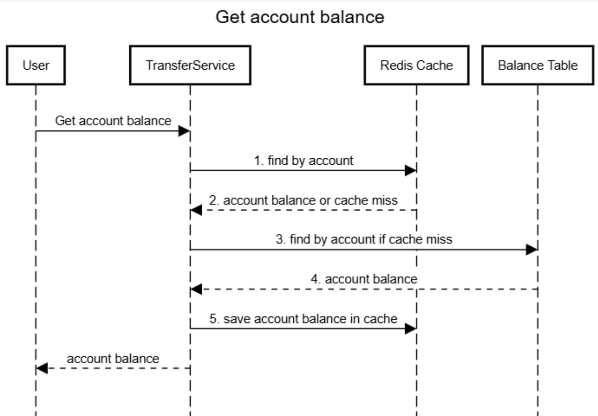
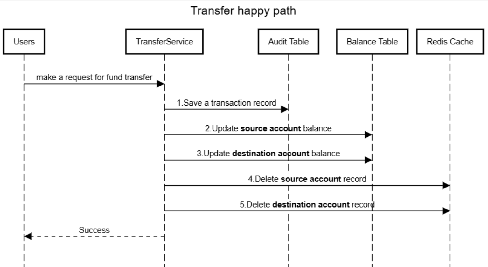
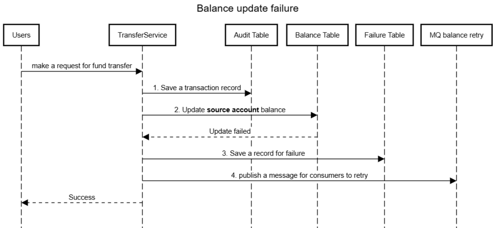
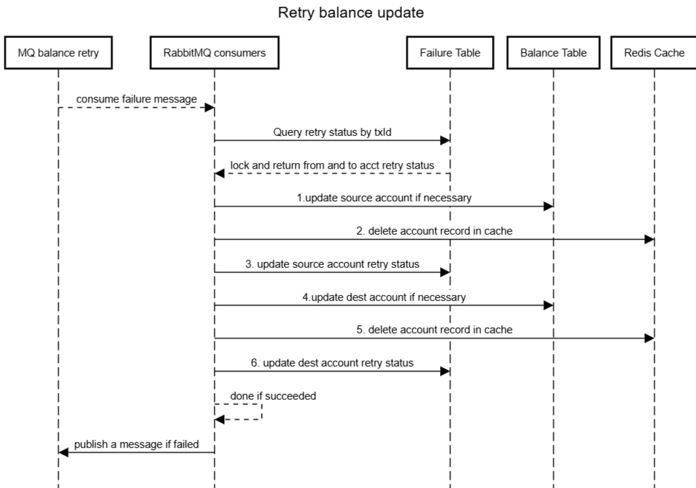
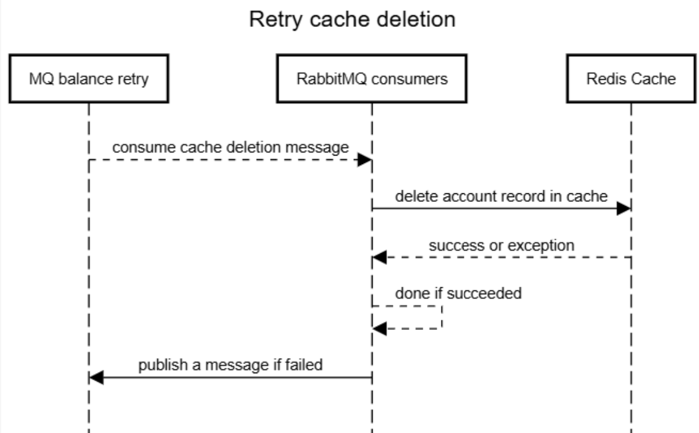

#### API design
In the fund transfer service, we have 2 restful APIs.
##### Get account balance
GET /api/balance/{account}
response: account balance

##### Make a fund transfer from one account to another
POST /api/transfer
Post body:

```
    {
      fromAccount: "xxx",
      toAccount: "xxx",
      amount: 22.12
    }
```

Success reponse
```
{
  transactionId: "xxx",
  transferStatus: 0
}
```

## Architecture design
The fund transfer system consists of 4 parts
1. Java spring boot service
2. Message queue (RabbitMQ)
3. Redis cache
4. MySQL database

### MySQL database design
we will create 3 tables in MySQL database
#### 1) Audit table
Audit table saves every transfer request, including transaction id, from account, to account, transfer amount and timestamp. The SQL to create the table is shown below. This table is for the book keeping and the ultimate source of account balance.
```
CREATE TABLE Audit (
    id BIGINT AUTO_INCREMENT PRIMARY KEY,
    transactionid VARCHAR(40) NOT NULL UNIQUE,
    from_account VARCHAR(12) NOT NULL,
    to_account VARCHAR(12) NOT NULL,
    amount DECIMAL(18,2) NOT NULL DEFAULT 0.00,
    creation_time TIMESTAMP DEFAULT CURRENT_TIMESTAMP
) ENGINE=InnoDB;

-- Creating separate indexes for each column
CREATE INDEX idx_transactionid ON Audit(transactionid);
CREATE INDEX idx_from_account ON Audit(from_account);
CREATE INDEX idx_to_account ON Audit(to_account);
CREATE INDEX idx_creation_time ON Audit(creation_time);
```

#### 2) Balance table
Balance table saves account balance, including account and balance. It is for fast balance checking.
The SQL to create the table is shown below.
```
CREATE TABLE Balance (
    id BIGINT PRIMARY KEY AUTO_INCREMENT, 
    account VARCHAR(12) NOT NULL, 
    amount DECIMAL(18,2) NOT NULL DEFAULT 0.00
) ENGINE=InnoDB;

-- Create an index on the 'account' column
CREATE INDEX idx_account ON Balance(account);
```

#### 3) Failure table
Failure table saves transactions that fail in the middle of balance update. Transfer is considered success when the transfer is saved in Audit table. But we still need to update balance in Balance table. If any error occurs during balance update, save a record in Failure table and have separate asynchronous retry mechanism to update balances.
The SQL to create the table is shown below:
```
CREATE TABLE Failures (
    id BIGINT AUTO_INCREMENT PRIMARY KEY,
    transactionid VARCHAR(40) NOT NULL UNIQUE,
    from_account VARCHAR(12) NOT NULL,
    to_account VARCHAR(12) NOT NULL,
    amount DECIMAL(18,2) NOT NULL DEFAULT 0.00,
    from_status BOOLEAN DEFAULT false,
    to_status BOOLEAN DEFAULT false,
    creation_time TIMESTAMP DEFAULT CURRENT_TIMESTAMP
) ENGINE=InnoDB;

-- Creating separate indexes for each column
CREATE INDEX idx_failures_transactionid ON Failures(transactionid);
CREATE INDEX idx_failures_from_status ON Failures(from_status);
CREATE INDEX idx_failures_to_status ON Failures(to_status);
CREATE INDEX idx_failures_creation_time ON Failures(creation_time);
```
### Redis cache design
We have redis cache in the system to cache account and balance KV pair. The cache is for fast account check. Here we use cache aside pattern to manage the cache.
**For balance read**, we return balance if account is found in cache. If we have cache miss, find account balance in MySQL Balance table and save the account balance in Redis.
**For balance write**, after each successful write to MySQL balance table, we delete the account record from Redis. Further read will reload the balance from database to cache. If deletion of cache record fails, publish a message to RabbitMQ to retry the deletion.
Set a random expiration time between 12 and 24 hours to ensure eventual consistency between db and cache.

### RabbitMQ design
We have rabbitMQ for retry mechanism. We retry 2 things: 1) balance update in db, 2) cache deletion.
##### 1. db balance update retry
Transfer is considered success as long as a record is saved in Audit. Later on we synchronously update account balance in Balance table for both from account and to account. This is the happy path. hopefully it goes well so that db balances and cache are all updated. But if any of the 2 account updates fails, we save a record in Failure table. At the same time publish a message to RabbitMQ for retry. We instantiate a number of consumers (configurable) in the Java service and fetch messages from MQ, and update failing balances based on Failure table.

##### 2. cache deletion retry
We delete cache record after db balance changes. Cache must be consistent with the db. But if cache deletion fails, push a message to RabbitMQ and a number of consumers will fetch the messages and retry record deletion. By the way, if the messages are missing somehow, we rely on expiration time on reids for eventual consistency.

### API Time Sequence
##### 1. Get account balance

##### 2. Transfer happy path

##### 3. Balance update failure

##### 4. Retry balance update

##### 5. Retry cache deletion


### How to run the application
You could pull it down and run it locally in IDE. The configuration of Redis and RabbitMQ is in the source code. You probably need to configure your database connection. And you may need to build a container for the application and deploy it to a Kubernetes cluster. The remaining effort includes building a k8s cluster in cloud and deploying and running all kinds of tests in cloud platform. I will have them done when I have spare time.

Hope you have a good day. 
